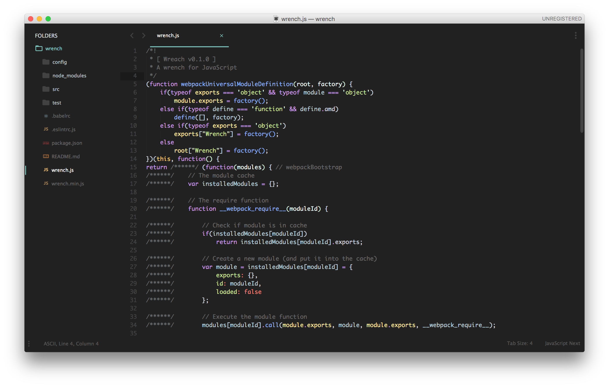
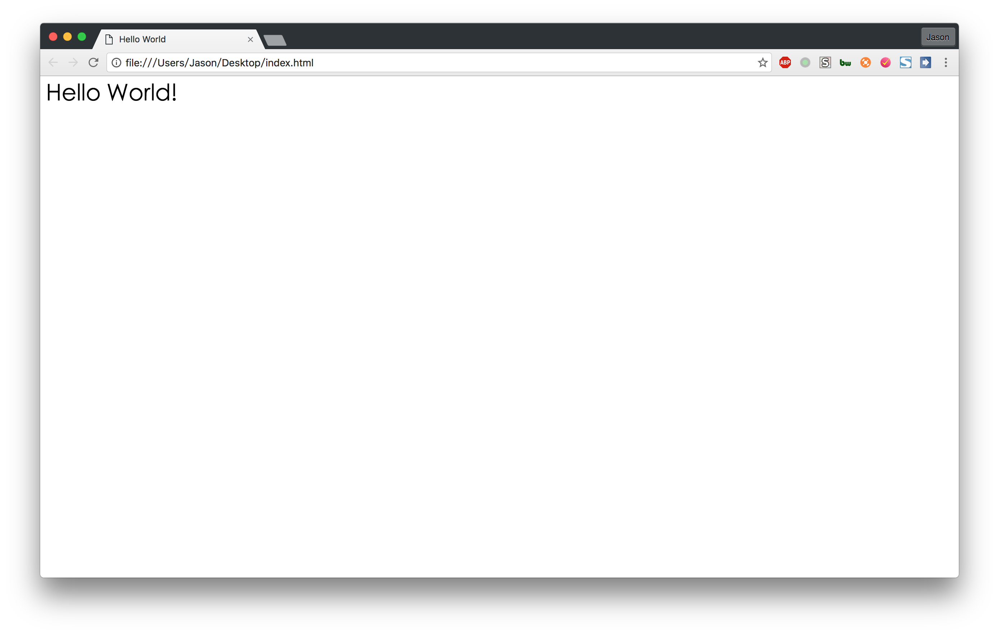

# 入门开发环境

最早的前端开发非常的简单，其实就是普通的 HTML 代码和一些简单的 CSS 和 JavaScript 代码。

从现在开始，到我们介绍新的开发环境之前，你在写前端代码的时候都应该使用如下的开发环境进行开发。

### 编辑器

HTML 其实就是有规范的文本语言，浏览器根据规范来把 HTML 解析成一个网页。

CSS 是用来规定 HTML 样式的文件。

JavaScript 是网页上的脚本语言，用来执行一些逻辑操作。

那么编辑这些文件，我们需要一个编辑器，不想 C、C++ 等编译语言，我们不需要 IDE（集成开发环境），我们只需要一个文本编辑器。为了方便我们的开发，这个文本编辑器必须有代码高亮的功能（即根据不用的语言语法，对代码进行着色）。

在这里，我们选择 Sublime Text，点击下载 [Sublime Text](https://www.sublimetext.com/3)。

Sublime Text 这个编辑器是十分强大的，可以安装插件，可以定制主题，详细的可以看 [Sublime Text 相关](http://www.jianshu.com/collection/ee72c144a060)。



### 浏览器

安装好了编辑器，我们需要继续安装前端开发的第二个程序，那就是浏览器。

这里我们推荐安装 [Chrome 浏览器](http://www.google.cn/intl/zh-CN/chrome/)

Chrome 浏览器有着最快的 Js 引擎 —— V8 引擎，同时对于 HTML、CSS 和 Js 规范的支持度是最高的，其次还有强大的调试功能，为了开发的方便，我们推荐使用 Chrome 浏览器。

### 走起第一个 HTML 页面

完成了两个的安装，我们开始来完成第一个 HTML 页面的。

在桌面新建一个文件，叫 `index.html`

用 Sublime Text 打开 `index.html`，把下面的代码打进去：

```html
<html>
  <head>
    <title>Hello World</title>
  </head>
  <body>
    <h1>Hello World!</h1>
  </body>
</html>
```

保存，然后使用 Chrome 浏览器打开，你将会看到如下页面：



ok！你完成了第一个 HTML 页面的学习，你可以继续学习了！